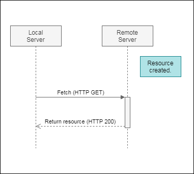
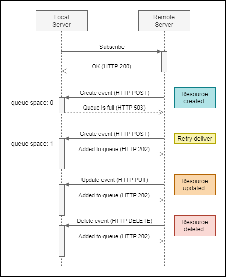

# Server-to-server Resource Federation Protocol

## 概要
この仕様では、サーバーが別のサーバー上のリソースを参照するためのプロトコルを規定します。

この仕様の最も基本的なアイディアは、一般的なWebアプリケーションで普及しているRESTful APIを拡張して、サーバー間の通信に応用するということです。

サーバーはブラウザ向けに提供されるAPIとは別に、サーバー間でリソースのやり取りをするためのAPIを実装します。

## リソース
具体的なリソースのエンドポイントは、この仕様では規定されません。
この仕様をベースにして規定されることを意図しています。

### リソースの取得
サーバーは、他のサーバーのリソースが必要になると、GETリクエストを送信してリソースを取得します。

- 取得したリソースはキャッシュとして保存できます(MAY)。
- リソースのキャッシュには有効期限を設けなければいけません(MUST)。
  有効期限はキャッシュが永久にサーバーに残り続けるのを防ぐために設定されます。
- リソースのキャッシュがある場合は、リソースの取得を行わずにそれを再利用できます(MAY)。

## イベント
他のサーバーで発生したイベントを受け取ることができます。

- イベントを受け取ったサーバーは、リクエストを処理キューに追加し`202 Accepted`を返し、
処理キューに空きがない場合は`503 Service Unavailable`を返さなければいけません(MUST)。
- `503 Service Unavailable`のレスポンスを受け取ったサーバーは、イベントを再送すべきです(SHOULD)。

### イベントの購読
TODO

### リソースの作成イベント
POSTリクエストを連合先の全サーバーに送信して、サーバーに新しいリソースが作成されたことを通知します。

このイベントを受け取ったサーバーは、新しくリソースのキャッシュを作成します。

### リソースの削除イベント
DELETEリクエストを連合先の全サーバーに送信して、サーバーからリソースが削除されたことを通知します。

このイベントを受け取ったサーバーは、保存されているリソースのキャッシュを破棄します。

### リソースの更新イベント
PUTリクエストを連合先の全サーバーに送信して、サーバーのリソースが更新されたことを通知します。

このイベントをサーバーが受け取ると、保存されているリソースのキャッシュを更新します。
