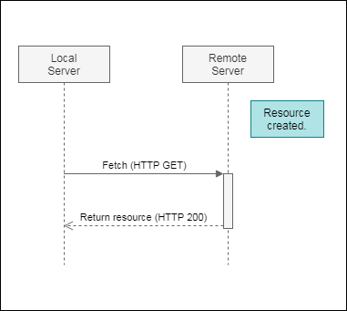

WIP

# Core Specification
この仕様では、サーバーが別のサーバー上のリソースを参照するためのプロトコルや基本的な考え方を規定します。

この仕様の最も基本的なアイディアは、一般的なWebアプリケーションで普及しているRESTful APIを拡張して、サーバー間の通信に応用するということです。

サーバーはブラウザ向けに提供されるAPIとは別に、サーバー間でリソースのやり取りをするためのAPIを実装します。

## リソース
各種リソースの具体的なエンドポイントは、この仕様では規定されません。
この仕様をベースにして規定されることを意図しています。

### リソースの取得
リモートサーバーのリソースが必要になったときは、GETリクエストを送信してリソースを取得します。

サーバーは取得したリソースをキャッシュし、通信コストを減らすことができます。

- リソースの取得には、GETリクエストを使用しなければいけません(MUST)。
- 取得したリソースはキャッシュとして保存できます(MAY)。
- リソースのキャッシュには有効期限を設けなければいけません(MUST)。
  有効期限はキャッシュが永久にサーバーに残り続けるのを防ぐために設定されます。
- リソースのキャッシュがある場合は、リソースの取得を行わずにそれを再利用できます(MAY)。

### イベント
他のサーバーで発生したイベントを受け取ることができます。
リソース毎にイベントのエンドポイントが設けられます。

処理キューに追加して後からイベントを処理する場合：
- イベントを受け取ったサーバーは、リクエストを処理キューに追加して`202 Accepted`を返します。
- 処理キューに空きがない場合は`503 Service Unavailable`を返さなければいけません(MUST)。
- イベント配送側が`503 Service Unavailable`のレスポンスを受け取った場合は、時間を空けてそのイベントを再送すべきです(SHOULD)。

### イベントの購読
TODO

### リソースの作成イベント
POSTリクエストを連合先の全サーバーに送信して、サーバーに新しいリソースが作成されたことを通知します。

このイベントを受け取ったサーバーは、新しくリソースのキャッシュを作成します。

### リソースの削除イベント
DELETEリクエストを連合先の全サーバーに送信して、サーバーからリソースが削除されたことを通知します。

このイベントを受け取ったサーバーは、保存されているリソースのキャッシュを破棄します。

### リソースの更新イベント
PUTリクエストを連合先の全サーバーに送信して、サーバーのリソースが更新されたことを通知します。

このイベントをサーバーが受け取ると、保存されているリソースのキャッシュを更新します。

## サーバーの認証と同一性の保証
トークン認証でサーバーを認証することで、サーバーの同一性を確認できます。
認証に成功すると、そのトークンに紐付けられたサーバーIDが取得されます。

## トークン認証の方法
OAuth 2.0のBearer認証の方式を用いてリクエストの認証を行います。

認証方式についての詳細はRFC 6750「The OAuth 2.0 Authorization Framework: Bearer Token Usage」を参照してください。

## サーバーのベースURL
サーバーは1つのベースURLと関連付けられ、他のサーバーはこのベースURLに対して通信を行います。

ベースURLはそのサーバーへのリンクとして機能しますが、直接的にサーバーを識別するためのものではありません。
サーバーの識別にはサーバーIDが用いられます。

ベースURLは将来的に別のサーバーから使用される可能性があります。

サーバーは最後に認証に成功したベースURLを保持します。
