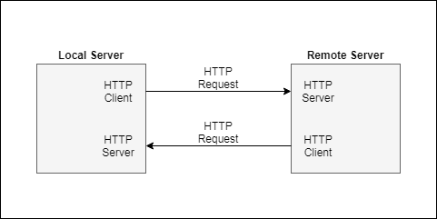

# インターフェース
通信にはHTTPサーバーとHTTPクライアントを使用する。

# リソース
要件:
- 相手サーバーにあるリソースは必要になったときに要求できるように
- サーバーにあるリソースに変化があった場合に、そのイベントを受け取れるように
  - イベントの種類(CRUD、リソースのタイプなど)を選択できると便利？

# サーバー関係
要件:
- 認証した相手のサーバーにのみデータを送れるように
- 相手サーバーが誰であるかを識別できるように
- 同じドメインで別のサーバーを運用できるようにする
- 別のドメインにサーバーを移行できるように
- サーバーが閉鎖された後に偽サーバーが運用されることを防ぐ
- 移行先のドメインを通知できるように (TODO)

## 認証した相手のサーバーにのみデータを送れるように
相手サーバーが発行する公開鍵を用いて、相手サーバーに送信するデータを暗号化する。
その鍵ペアを持っている相手サーバー以外には送受信している内容が分からない。

暗号化したデータを相手サーバーが正しく受け取れないだけなので、相手サーバーが本物のサーバーなのかは分からない。
その意味で、本来の認証とは少し違うかも知れない。

認証プロセスをもう少し考える必要があるかも。

通信する相手サーバーにある公開鍵を取得する。
HTTPリクエストを送信する際は、その公開鍵でデータを暗号化して送信する。暗号化にはAES暗号を使用する。
- (まだ鍵を取得していない場合) 相手のサーバーが公開している公開鍵を取得し、保存する。
- (既に鍵を取得している場合) 保存している鍵を使用する。

## 相手サーバーが誰であるかを識別する
サーバーが公開している公開鍵で識別できる。

相手サーバーが公開している鍵とローカルサーバーが保持しているの鍵(そのドメイン用)が異なる場合、
そのドメインで運用されているサーバーが別のサーバーに変わったことが分かる。

## 別のドメインにサーバーを移行
サーバーの鍵ペアをそのまま使用して、別のドメインにサーバーを移行できる。

移行する際に、これまで通信したことのあるサーバーに対して、ドメインの移行を通知できると親切。
明示的にこの操作が行われなくてもローカルサーバーから最初に通信が行われた際にはサーバーの移行を検出することができる。
ただし、ローカルサーバーから最初に通信が行われるまでの間に、相手サーバーから通信が行われると移行先が分からないためデータを破棄(or保留)にするしかない。

### サーバーの移行先を検出する
別のドメインにサーバーが移行しているかどうかを確認する。公開鍵を元にして移行先ドメインを検索する。
移行先が見つからなかった場合、ローカルサーバーはそのサーバーへのデータ送信を全てキャンセルする。

## サーバーが閉鎖された後に偽サーバーが運用されることを防ぐ
例えば、偽のサーバーが公開鍵を偽装したとしても、
その相手サーバーが秘密鍵を持っていない限りは、送信したデータを復号化することができない。
